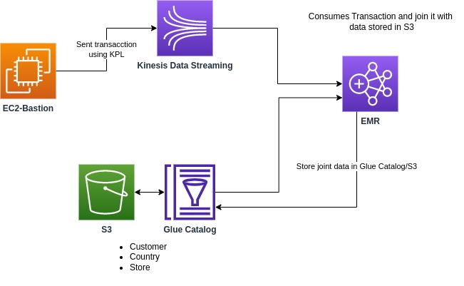
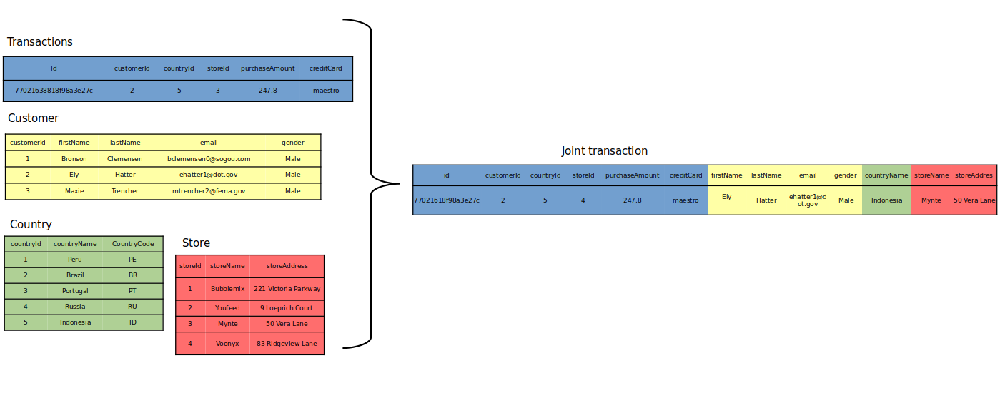

# spark-kinesis-consumer

This repository contains the infraestructure and code of a real-time pipeline using AWS Services and Apache Spark

### Cloudformation 

+ aws-vpc.yaml - VPC and network stuff 
+ producer.yaml - EC2 Bastion
+ main.yaml - EMR and Kinesis

### Spark Kinesis Consumer

It connects with kinesis to consume real time data, then read static data as Hive tables using AWS Glue Catalog, then it joins both and store it in S3 as Hive table.

## Use Case

The scala-producer aplication is launched inside EC2 bastion, this application sends transaction data to AWS Kinesis Streaming.

In other side there is data store in AWS S3 (store.csv, country.csv and customer.csv) and its metadata is stored in AWS Glue Catalog.

Then the spark consumer application is launched on top AWS EMR, this aplication consumes real time data from AWS Kinesis and static data from AWS S3/AWS Glue Catalog, it joins data from both sources and store it in AWS S3.

- Streaming Data from AWS Kinesis: Transactions.
- Static Data from AWS S3: Country, Store and Customer.

